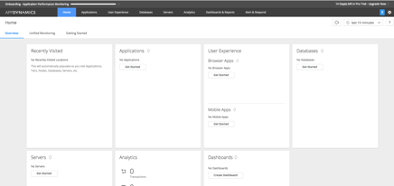
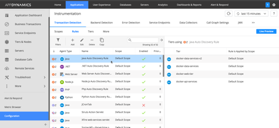

# SE-LAB-BOOTCAMP
Repository for the SE Bootcamp Lab

# Lab Pre-Reqs

## Setting up the Lab

After installing the controller, lab owners or participants should load the ***lab/artifacts/controller-app-config-lab-default.xml*** configuration into the controller.  This is the base application config we should begin with to start the lab.


## Ravello Blueprint

The ***se-botcamp-lab-4.3-v1.2-bp*** Ravello lab blueprint contains 2 VMs - a Lab VM, and Controller VM.  We have bridged the VMs enabling the application tier to communicate with the controller using Ravello's internal network.

[https://cloud.ravellosystems.com/#/0/library/blueprints/83624181/canvas](https://cloud.ravellosystems.com/#/0/library/blueprints/83624181/canvas)


### Ravello Hostnames

For reference, we've assigned the following short names for the controller:

* Application VM - ***sebootcamplab***
* Controller VM - ***se43rccontroller***

This means that from the Lab VM, you can reach the controller using only the short, unqualified, hostname.  For example, from our Application VM:

```
ubuntu@sebootcamplab:~/artifacts$ ping se43rccontroller
PING se43rccontroller.localdomain (10.0.0.3) 56(84) bytes of data.
64 bytes from se43rccontroller.localdomain (10.0.0.3): icmp_seq=1 ttl=64 time=2.12 ms
64 bytes from se43rccontroller.localdomain (10.0.0.3): icmp_seq=2 ttl=64 time=1.04 ms
64 bytes from se43rccontroller.localdomain (10.0.0.3): icmp_seq=3 ttl=64 time=0.851 ms
```

You can also connect to the controller on port 8090, for example:

```
ubuntu@sebootcamplab:~/artifacts$ telnet se43rccontroller 8090
Trying 10.0.0.3...
Connected to se43rccontroller.localdomain.
Escape character is '^]'.
```

## Connecting to your Ravello instance

### Starting your instance

Each lab participant will be given a unique Ravello Application Instance, which can be thought of as a dedicated environment containing two virtual machines - lab and controller - for the duration of the bootcamp.  For cost savings, Ravello instances are shutdown periodically and bootcamp attendees may need to restart their instances prior to working through the labs.

If your instance is stopped, which will typically happen each night, all configuration and progress will be saved provided you don't delete your application from Ravello all together.

To start your instance, you can log into the SE Ravello Account [https://www.ravellosystems.com/](https://www.ravellosystems.com/), find your dedicated application instance and simply restart it.  **Or**, if you weren't given a dedicated instance simply create a new application instance of the **se-enablement-bootcamp-4.3-bp**.

**NOTE** The instance may take a few minutes to start, which is normal.

### SSH Access

Ravello creates a virtual machine that you access via SSH with a dedicated IP or Fully Qualified Hostname (FQDN).  You can login to your instance with the FQDN or IP using *ssh* and the *4_3_Enablement.pem* key which will be provided for you.

The username to your Ravello instance is *ubuntu*.  

####Example SSH Access

```
ssh -i 4_3_Enablement.pem ubuntu@seenablementbootca-seenablementbootca-jxgau5cv.srv.ravcloud.com
```


# Installation

## Download Artifacts

All artifacts needed for your lab have been pre-staged to the `artifacts` folder:

```
ubuntu@seenablementbootca:~$ ls -l artifacts/
total 900268
-rw-r--r-- 1 ubuntu ubuntu  16185484 Mar 30 01:31 AppServerAgent-4.3.0.0.zip
-rw-r--r-- 1 ubuntu ubuntu 819171319 Mar 30 01:38 controller_64bit_linux-4.3.0.0.sh
-rw-r--r-- 1 ubuntu ubuntu  86506512 Mar 30 01:39 dbagent-4.3.0.0.zip
```

## Installing the Controller

***CHECK WITH YOUR LAB LEADER TO VALIDATE THIS STEP IS NEEDED***

Check with your lab leader first.  If it hasn't already been done, start by installing the controller into `/opt/appdynamics/controller`.

You'll find a 4.3 distribution pre-staged in the `artifacts` sub-folder, and should find clear documentation on [https://docs.appdynamics.com/](https://docs.appdynamics.com/).

It should take you less than 20-minutes to install the controller.  When you're done, login to the controller and show a lab helper that you've completed the first step.



<p><p>

```
*NOTE*

YOU MUST UPDATE THE LICENSE FILE to complete the Controller Installation
```

### Hints
* Our customer is OK with the default ports, no changes are needed
* Make sure to document all usernames and passwords that you create
* Licenses can be downloaded from the AppDynamics self-service license portal


### Questions to consider
* Should we use a single or multi-tenant mode, why?
* We're going to monitor 1 application with less than 15-nodes, what controller profile(s) could we choose and why?
* What resources on our machine should we validate to choose a profile, where can we find the pre-reqs listed in the documentation?
* Do we have to install the controller as *root*?

## Installing the Application

## Lab Structure
The reference application we'll be using for our lab should already exist on the virtual machine under `~/SE-LAB-BOOTCAMP/lab`.  For example:

```
ubuntu@seenablementbootca:~/SE-LAB-BOOTCAMP/lab$ ls -l
total 12
drwxrwxr-x  5 ubuntu ubuntu 4096 Mar 30 19:20 artifacts
drwxrwxr-x 12 ubuntu ubuntu 4096 Mar 30 19:20 source
-rw-rw-r--  1 ubuntu ubuntu  872 Mar 30 19:20 README.md
ubuntu@seenablementbootca:~/SE-LAB-BOOTCAMP/lab$

```

We'll refer to this top-level folder as ${APP_HOME}.  

### Application Runtime
The application is deployed as a set of micro-services running inside of docker containers.  The details of the application build out is out of scope for this lab.

## Enabling AppDynamics Monitoring

### Agent Binaries

We've provided the base agent distributions in */home/ubuntu/artifacts*, and already unpacked the  binaries you'll need into */opt/appdynamics/agent*

```
ubuntu@seenablementbootca:/opt/appdynamics/agent$ ls -l
total 12
drwxrwxr-x 5 ubuntu ubuntu 4096 Mar  8 17:20 analytics-agent
drwxrwxr-x 4 ubuntu ubuntu 4096 Apr  1 15:59 appserver-agent
drwxrwxr-x 8 ubuntu ubuntu 4096 Apr  1 15:58 db-agent
```

We've also given `777` permisions on */opt/appdynamics/agent* which is not typical for installations, but needed for the lab setup specifically.
 
### Configuring the Agent => Controller Connection
 
***CHECK WITH YOUR LAB LEADER TO VALIDATE THIS STEP IS NEEDED***

We need to configure the Agent to talk to the Controller we've installed on the localhost by updating the App Agent's *controller-info.xml* file.  

We need to correctly set the following attributes:

+ <controller-host></controller-host>
+ <controller-port></controller-port>
+ <account-access-key></account-access-key>
+ <application-name></application-name>

You can get the access key information from your Controller UI.  You can choose any name from the application-name.

`NOTE*` Make sure you use the FQDN of your Ravello VM for the **controller-host** property, as opposed to **localhost** or **127.0.0.1**.  All application services will be running inside Docker containers, and will not properly link to localhost network configurations.`

`NOTE**` The application build scripts will take care of setting the Tier and Node properties, these don't need to be set in controller-info.xml.`

## Updating the Agent [Lab Admins]
Agent updates can be dropped in as normal.

For lab admins that want to update the Agent, either in the Ravello blueprint or the application, make sure to copy *custom-activity-correlation.xml* from ${SE-LAB-BOOTCAMP}/lab/artifacts/custom-activity-correlation.xml to /opt/appdynamics/agent/appserver-agent/verx.x.x.x/conf/custom-activity-correlation.xml.  

If you **do not** update custom-activity-correlation.xml, you won't be able to properly correlate from the web to the data services tiers.


##### Questions?
+ What are the 3 properties we need to set, at a minimum, to connect our agent to the controller?
+ Should we set the configuration in the top-level or version specific configuration file; e.g. ${AGENT_HOME}/conf/controller-info.xml **or** ${AGENT_HOME}/${version}/conf/controller-info.xml?

## Building the Application

To minimize lab startup time, we've pre-built the docker images for you.  However, if you need to rebuild them for some reason, you can run the build script ${APP_HOME}/source/build-[linux | mac].sh.  For example:

```
ubuntu@seenablementbootca:~/SE-LAB-BOOTCAMP/lab/source$ ./build-lab-linux.sh
```

`NOTE This may take a few, posibly several, minutes depending if we need to pull down additional resources from Docker Hub.`

## Starting the Application

Running ${APP_HOME}/source/start-lab.sh will start the lab.  The script expects parameters pointing to the App Server, and Analytics Agent.  These can be found in */opt/appdynamics/agent*

`NOTE` before you can start the Application you **MUST** configure the agent to communicate with the controller.


**For example**

```
./start-lab.sh -a /opt/appdynamics/agent/appserver-agent -b /opt/appdynamics/agent/analytics-agent
```

To make things a little easier, we've also added a helper script 

**ubuntu@sebootcamplab:~/SE-LAB-BOOTCAMP/lab/source$ ./start-lab-helper.sh**

which wil start the lab automatically, passing in the right 

The application often takes between 2->3 minutes to fully come up, especially on a Ravello instance.

## Basic Docker Commands

### See the state of the application

```
🐳  docker-compose ps
            Name                           Command                State     Ports
---------------------------------------------------------------------------------
devops-analytics-agent          /bin/sh -c /opt/appdynamic ...   Exit 127
devops-api-services             /opt/jboss/wildfly/bin/sta ...   Exit 137
devops-data-services-mongo      catalina.sh run                  Exit 143
devops-data-services-mysql      catalina.sh run                  Exit 143
devops-payments-mock-services   /bin/sh -c java -jar wirem ...   Exit 137
devops-payments-web             catalina.sh run                  Exit 143
devops-user-mongo               /entrypoint.sh mongod            Exit 0
devops-user-mysql               docker-entrypoint.sh mysqld      Exit 137
```

### Viewing application log files

```
#Tails all log files
ubuntu@seenablementbootca:~/SE-LAB-BOOTCAMP/lab/source$ docker-compose logs -f

OR 

#tails logs for 1 service
ubuntu@seenablementbootca:~/SE-LAB-BOOTCAMP/lab/source$ docker-compose logs -f <service>
```

## Generating load

In **SE-LAB-BOOTCAMP/lab/source/scripts/load-gen** sub-directory you can run the **run-all-load-background.sh** script to generate load in the background, with all debug logging being piped into */dev/null*, or you can run *./load-gen-all-versions.sh* to generate load in the foreground including debug logging.

```
ubuntu@seenablementbootca:~/SE-LAB-BOOTCAMP/lab/source/scripts/load-gen$ ./load-gen-all-versions.sh
```

# Lab Challenges

The following challenges are broken into EASY, MEDIUM, and HARD categories.  Work as a ***TEAM*** work together to complete as many challenges as you can.  Challenges can be individually assigned to team members, so team members can work on different challenges in parallel, but the end result will be a team and not individual score.

All teams have a fixed amount of time, so make sure you read through all challenges first to balance what you can accomplish relative to the complexity and value in terms of points.

The team with the highest overall point total will win the lab hackathon!

# Apprentice (+25 points per-challenge)


## Start the application

Start the lab and show proof of the initial flow-map to a lab helper.  The initial map should like something like:


### Bonus (+10 Points)

First team to show a lab helper the flow-map gets +10 points.


## License Update

Our account team decides to extend the license for another 2-weeks.  Request and get a 2 week license trial for an on-premise controller that includes access to the entire AppDynamics platform.

Show proof of the license file in your inbox to a lab helper, but don't update the controller license as we don't want to generate a new access key and restart the lab.

## Business Transaction Configuration

We're coming into an opportunity where a prospect has already downloaded a self-service evaluation, and completed the initial agent installation and configuration.  They've messed up the default configuraiton, and now instead of getting meaningful business transactions, all they see is a single transaction - ***devops-payments-web***.

Update the **Java Discovery Rule** that is tied to the default scope, to name Business Transactions using the first 2 URL segments.  Your BT list should look close to:


## Database Monitoring

The operations team we're working with struggles to get visibility into their backend database.  Setup database monitoring and create a collector to connect to the MySQL instance, using the following connection info:

* **HOST** localhost
* **USER** monitor
* **PORT** 3306

```
ubuntu@sebootcamplab:~/SE-LAB-BOOTCAMP/lab/source/mysql-database$ mysql -h localhost -P 3306 --protocol=tcp -u monitor -p
```


***NOTE*** We've staged and unpacked the database collector to */opt/appdynamics/agent/db-agent*.  You will need to configure the collector by updating ***${DB_MON_HOME}/conf/controller-info.xml*** and setting the necessary configuration parameters.


***HINT*** Remember our controller hostname is ***se43rccontroller***.

###Docs
See AppDynamics docs for configuration needing to be set.

## DB Monitoring Bonus Challenges (+15 points each)

### Linux Service

Setup the database collector to run as a linux service, as opposed to in the foreground.  

***HINT*** You have full sudo privileges, and are running Ubuntu Linux.

### Hardware Monitoring
Configure the DB Collector to collect hardware metrics, using the following configuration:

* ***USER*** dbmonitor
* ***PASSWORD*** dbmonitor
* ***SSH Port*** 22

We haven't enabled the user to have SSH access to the Ravello box, go ahead and get signoff by showing the configuration you used.

***NOTE*** Yes, we know this is redundant to the Server Visibility Monitor (SVM) that is running on the same server.  It's just a lab exercise :)


## Server Visibility Monitoring (SVM)

**appdynamics-machine-agent.rpm** has been staged to ~/artifacts.  Install, configure and start server monitoring using the RPM package.

Set the Unique Host ID property to ***AWS-WEST-SE-DEVOPS-1*** and make sure the full SIM (SVM) agent capabilities are enabled.

In order to get full credit, the name of the Server must be SE-LAB and it must be organized into the BOOTCAMP hierarchy.


### SVM HINTS

***HINT*** You have full sudo privileges, remember our controller hostname is ***se43rccontroller***.

***HINT*** Look for the ***sim-enabled*** and ***machine-path*** configuration properties.


# Journeyman (+50 points per-challenge)

## BT Naming

Our prospect downloaded a self-service trial, and has caused issues with our out of the box business transactions by misconfiguring the default BT rules.

Instead of unique business transactions that clearly map to the business functions delivered by the application, all requests are being grouped into a single BT bucket - ***/devops-payments-web***.


Our application has a UI you can access at *http://<ravello-lab-hostname>:8080/devops-payments-web*.  

For example - *http://sebootcamplab-seenablementbclab4-j7c9b7s3.srv.ravcloud.com:8080/devops-payments-web/index.html*.


Analyze the different functions provide by the application, and update the Java Auto Discovery Rule - applied to the default scope - so we have a meaningful BT naming rule.



Validate with a lab helper that after updating the default rule, your BT list now looks similar to this:


### BT Naming Hint

+ There are several possibilities for updating our rule.  The important point is not to match the solution exactly but to define a rule that gives us meaningful business transaction names that align to the functionality provided by our application.

+ Rule updates are typically made dynamically, however is some small latency applying configuration updates.  To make this go faster, I'll often:
   + Stop the application
   + Delete the original (bad) BT
   + Restart the application to flush the rules


## BT Configuration - Custom Match Rule

***NOTE*** You must complete the BT Naming Challenge before moving on to the Custom Match Rule.

Our development team is experimenting with using a Mongo backend vs MySQL, and they've provided a back door to force transactions to flow one version of the architecture vs the other.

They are controlling this behavior using a URL parameter - *mode* - to funnel transactions to either MySQL or Mongo.

They've shared their load testing scripts (which are pretty simple) and they want to know how to use AppDynamics to split the ***accountLookup*** business transaction to refelect whether it's hitting MySQL or Mongo.

* curl -v http://127.0.0.1:8080/devops-payments-web/accountLookup?mode=mysql;
* curl -v http://127.0.0.1:8080/devops-payments-web/accountLookup?mode=mongodb;

Create a ***Custom Naming Rule*** that is applied to ***only*** to the ***docker-web-tier***, and ***only*** matches the request for accountLookup to split and name requests based on whether they hit MySQL or MongoDB.


###Challenge Sign-off Requirements
* Does the naming rule split requests to account lookup based on whether they hit MySQL or MongoDB?
* Is the rule scoped to only the web tier?
* Does the rule apply to just the accountLookup requests?

### Bonus (+ 25 points)
How can I test the rule I'm creating in real-time to understand if it will work as I expect, before applying the instrumentation change?

## Error Diagnostics

*** MUST COMPLETE THE BT NAMING (but not custom match rule) CHALLENGE BEFORE ATTEMPTING THIS***

Our users are complaining about a lot of errors with a specific application function.  Use AppDynamics to identify the 1 Business Transaction with the highest error rate, and then diagnose and report on the root-cause failure.

###Challenge Sign-off Requirements
* Correctly identify the worst BT in terms of errors
* Diagnose the root-cause of the error problem
* In addition to the root-cause, show the trend of the error over time so our team can understand how long this has been occurring.


## Application Service KPI Monitoring

We're engaging with a developer team that ***only cares about seeing their backend service calls***.  Identify the feature in AppDynamics that specifically targeted to providing Application Service focused KPIs.

Then, configure the feature so that ***ONLY*** Web Service calls are tracked, and nothing else.

## Read through the Lab Challenge

Congratulations for actually reading through the lab, first team to signal a lab helper and point out this challenge gets an automatic 25-point bonus.


## Remote Services (Backend Services)

Our asks how they can configure AppDynamics to provide a better breakout and naming convention for the remote services calls from ***docker-api-services***.


Instead of ``http://<hostname>:<port>`` they want the remote services to be identified using the first 3 segments of the URL only.  Update AppDynamics so the remote service calls coming from ***docker-api-services*** use the requested naming convention.


## Browser Real User Monitoring (BRUM)

Our dev and operations team want to understand true user response-time, and be able to detect and breakdown client vs backend service times. 

The application dev team has pointed Ops to a simple enhnancement to enablement Browser Real User Monitoring (RUM) by updating the home page, and a base JSP file.

### Enabling Browser RUM on our Lab Application* 

There are multiple approaches to enabling Browser RUM, for the purpose of our lab we'll modify our source code directly.

In *~/SE-LAB-BOOTCAMP/lab/source/java-web-tier/src/main/webapp*, add AppDyamics RUM configuration to:

* index.html
* ***AND*** jsp/response.jsp

Re-build the service, from the ~/SE-LAB-BOOTCAMP/lab/source/java-web-tier directory run the ***build.sh*** script.  And then stop / restart the application.

After the app is back up (approximately 3-minutes) navigate through the app - *http://<ravello-lab-hostname>:8080/devops-payments-web/* to generate load.


###Challenge Sign-off Requirements

* Using a browser developer tool (like Firebug, or Chrome Developer Tools) find and describe the 2 mandatory javascript files that you can use to determine RUM is correctly enabled.
* Demonstrate that Browser RUM is working by showing the Browser App Dashboard
 

## Mongo DB Exit Point

Our development team wants to break out the calls to MongoDB on the flow-map, and understand how much time is typically spent in Mongo vs MySQL.  Out of the box, AppDynamics doesn't detect the API calls in the Mongo Client Framework and we'll need to add additional configuration to call this out.

Configure an exit point so that AppDynamics can explicitly break out, and measure, the calls to MongoDB.  Create a dashboard that shows the aggregate response-time of all calls to MySQL vs MongoDB.


### Configuration Help

Our dev team is using a Mongo Client Framework, there are several points in the framework wherey queries to Mongo can happen, but it's always in a method name ***find*** within a Class that implements the ***com.mongodb.client.MongoCollection*** interface.

While you could create a rule that applies to all tiers in the application, our dev team's feedback is that you really only need to create the rule against the ***docker-data-services-v2*** Tier.

###Challenge Sign-off Requirements

* Is MongoDB clearly shown on the flow-map
* Do I have a dashboard that shows:
   * The number (load) and response-time of all calls going to MongoDB
   * The number (load) and response-time of all calls going to MySQL


# Master Craftsman (+100 points per-challenge)

## Is it the Database or the Application?

The dev team has used AppDynamics transaction snapshots to identify an issue with account lookup, and are actively debating with the DB team whether it's an application problem with a poorly written query, or a DB problem with an unoptimized DB query.


How can we use AppDynamics to prove what's happening?

### HINT
* This strongly benefits from having DB Monitoring enabled

### Challenge Sign-off
Use AppDynamics to explain your ***evidence*** to a lab leader.

## Broken End-to-End Correlation

Initial instrumentation of our application has been successful, but there are several breaks in correlation between our our web and data service tiers and we're not seeing the end-to-end correlation that we expect.


Our team has determined that due to the nature of the REST Service implementation used in the downstream tiers, custom correlation is required.  The AppDynamics team has dropped the necessary custom configuration file in the agent, but we're still not seeing correlation between the tiers.

Here's a snippet of the custom correlation file, it's been applied to both ***docker-data-services*** Tiers (v1, and -v2):

```
      <instrumentation>
          <class-name>com.appdynamics.sample.service.DataServices</class-name>
          <method-name>getUserProfile</method-name>
          <match-type>MATCHES_CLASS</match-type>
          <param-types></param-types>
      </instrumentation>
```

This tells us that we expect to set an instrumentation point on the ***DataServices** class in the ***getUserProfile*** method.

What can we do in the user interface to resolve this issue, what configuration could be ***masking*** this instrumenntation and breaking our correlation?

###Challenge Sign-off Requirements

* Show us the fow-map with correlation across the web and data-services tiers.


* ***AND*** explain how you got this picture

#### BONUS (+50 points)
What feature in AppDynamics could help troubleshoot and resolve this problem, ***show*** a lab leader how you could use this to explore your solution. 

`You must show this in action to get full credit.`


### Hint

+ The custom correlation file is only provided as an example of where the downstream instrumentation is set, this problem can be solved 100% in the user interface.
+ Are there any anomalies in the business transaction list that might point to a problem?


## Analytics (Business iQ)

### Transaction Analytics (+50 points)
Analytics can be enabled for on-premises controllers in low volume environments using the **Embedded Events Service** - [Embedded Events Service](https://singularity.jira.com/wiki/display/SALESENG/Business+iQ+-+Level+1+-+Architecture#BusinessiQ-Level1-Architecture-EmbeddedEventsService).

Imagine you are working with a customer and want to demonstrate an initial example of business iQ, something to get the conversation started around the *art of the possible*.

Setup the embedded events service, enable transaction analytics for **ALL** Business Transactions and derive an interesting observation and visualization.  

### Log Analytics (+50 points)
Enable log analytics to ingest and extract the agent log files in your environment.  The agent is installed in - ***/opt/appdynamics/agent/appserver-agent***.


# APM Guru (+150 points)


## Custom Correlation

The lab source code can be found here - [https://github.com/Appdynamics/SE-LAB-BOOTCAMP](https://github.com/Appdynamics/SE-LAB-BOOTCAMP).

Whenever a downstream call is made from the **API Services Tier**, an AppDynamics Correlator is passed into the request header.  

The Service Request is handled by the downstream tier, where all headers are extracted and placed into a **Map<String, String>** object.  Because of how JBoss' REST Services are implemented, AppDynamics is not able to automatically extract and correlate the requests.  

However, the **Map<String, String>** object is available, with the correlator, in the **getUserProfile()** method.  

Although it is already done for you in the lab, build the cust correlation need to properly correlate the upstream calls.  Be prepared to show and explain your work.

 
```

package com.appdynamics.sample.service;

import java.util.Enumeration;
import java.util.HashMap;
import java.util.Map;

import javax.servlet.http.HttpServletRequest;

import org.apache.log4j.Logger;

public abstract class DataServices {

	Logger logger = Logger.getLogger(DataServices.class);
	
	/**
	 * process the request context so we can create correlation
	 */
	public Map<String, String> processRequestContext(HttpServletRequest context) {
		Enumeration<String> headers = context.getHeaderNames();
		
		Map<String, String> map = new HashMap<String, String> ();

		while (headers.hasMoreElements()) {
			String key = headers.nextElement();
			String value = context.getHeader(key);
			
			logger.debug("Adding header " + key + "=" + value + " to Map");
			
			map.put(key, value);
		}
		
		return map;	
	}
	
	/**
	 * 
	 * @param requestContext
	 */
	public String getUserProfile(Map<String, String> requestContextMap)
	{
		return getUserProfileImpl(requestContextMap);
	}
	
	protected abstract String getUserProfileImpl(Map<String, String> requestContextMap);
}
```